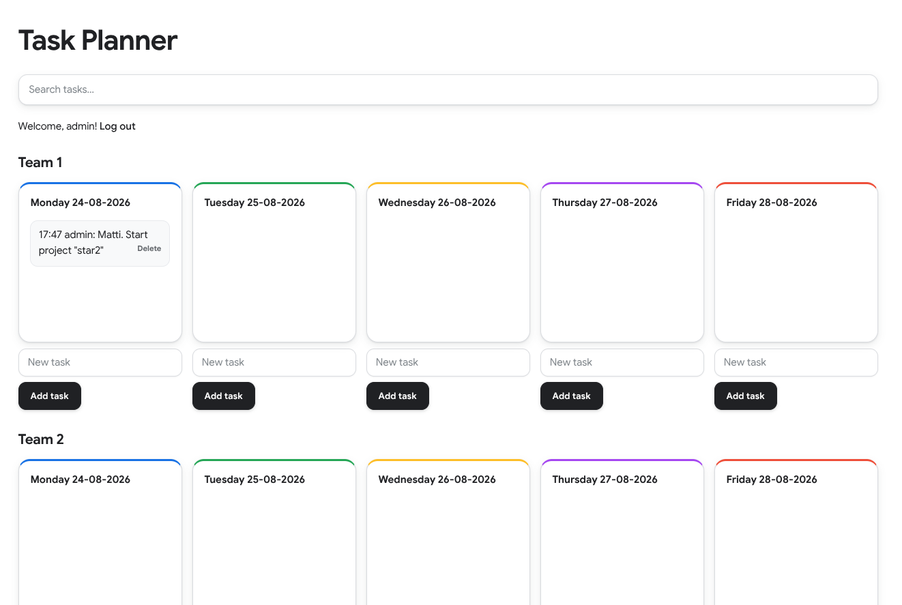

# team-todo-clojure

This simple Team Todo app, written entirely by ChatGPT in Clojure , allows for weekly planning and tracking of two teams of developers online.

[](https://www.youtube.com/watch?v=kXCNIs3WsyI)
Click the screenshot to see a video!

## Prerequisites

- Java,
- Clojure,
- leiningen.

## Usage

### on a Team Leader's machine:

```shell
$ cd <team-todo-clojure folder>
$ lein run
```
### on a Team member's machine:

In browser open page http://<IP address of the Leader's machine>:8888

## Notes

Leader's login "admin", password "12345" (can be changed in the file "users.edn")

## License

Copyright © 2025 Ruslan Sorokin, Matvei Odaryaev

This program and the accompanying materials are made available under the
terms of the Eclipse Public License 2.0 which is available at
http://www.eclipse.org/legal/epl-2.0.

This Source Code may also be made available under the following Secondary
Licenses when the conditions for such availability set forth in the Eclipse
Public License, v. 2.0 are satisfied: GNU General Public License as published by
the Free Software Foundation, either version 2 of the License, or (at your
option) any later version, with the GNU Classpath Exception which is available
at https://www.gnu.org/software/classpath/license.html.

# team-todo-clojure
